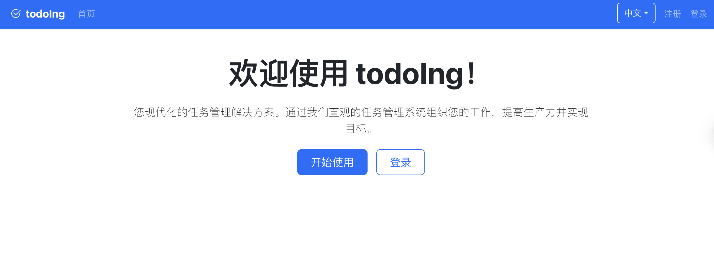

## TodoIng Plus v0.0.4
# TodoIng Plus v0.0.4



## ✨ 核心特性

- 周期事件推进：始终基于当前 event_date 向前 +1 周期（年/月/周/日）
- 相对提醒自动重排：推进后 recalculation，避免遗漏
- 时间线审计：created / advanced 均同步写入；空时间线自动回填 created
- 推进理由模态框：统一弹窗（可填写原因，可取消）
- 多视图事件看板：卡片 / 列表 / 紧凑 / 时间线
- 高亮与倒计时：统一 NowContext，最近推进项临时高亮
- i18n：中英文键值结构，易扩展

## 🏗️ 技术栈

| 层 | 技术 |
|----|------|
| 前端 | React, TypeScript, Vite, RTK Query, i18next |
| 后端 | Go, Gorilla/Mux, MongoDB Driver, Swagger |
| 数据 | MongoDB, Redis |
| DevOps | Docker / Compose, Makefile, Nginx |

## 🚀 快速体验 (Docker)

```bash
git clone https://github.com/axfinn/todoIngPlus.git
cd todoIngPlus/docker
cp .env.example .env
./deploy.sh golang up
# 前端: http://localhost   API: http://localhost:5004/api  Swagger: http://localhost:5004/swagger/
```

## � 推进与提醒逻辑

| 场景 | 行为 |
|------|------|
| daily/weekly/monthly/yearly | event_date += 周期；若仍落后当前时间继续滚动至未来 |
| one-off | 推进后设为 inactive，不再重复 |
| 时间线 | 写 system: created / advanced (meta.old/new/reason) |
| 相对提醒 | 仅在未定义 absolute times 时重算 next_send |

## 🕒 时间线策略

| 行为 | 结果 |
|------|------|
| 创建事件 | 写入 created system 条目 |
| 推进事件 | 写入 advanced system 条目（含 reason） |
| 为空首载 | 自动回填 created |
| 评论编辑 | 10 分钟窗口内可编辑 |

## ⚙️ 最小环境变量 (示例)

```env
MONGODB_URI=mongodb://localhost:27017/todoing
DB_NAME=todoing
JWT_SECRET=change-me
ENABLE_CAPTCHA=false
ENABLE_EMAIL_VERIFICATION=false
```

更多见 `.env.example`。

## 🧪 本地开发

```bash
# 后端
cd backend-go
go mod download
make run

# 前端
cd ../frontend
npm install
npm run dev
```

## 🔌 常用 API

| 功能 | 方法 & 路径 |
|------|-------------|
| 列出事件 | GET /api/events |
| 推进事件 | POST /api/events/{id}/advance {reason?} |
| 时间线 | GET /api/events/{id}/timeline |
| 添加评论 | POST /api/events/{id}/comments {content} |
| 创建提醒 | POST /api/reminders |

Swagger: [http://localhost:5004/swagger/](http://localhost:5004/swagger/)

## 💖 请作者喝咖啡 (Sponsor)

如果这个项目对你有帮助，欢迎请我喝杯咖啡（赞助将用于服务器与继续迭代）。

| 支付宝 | 微信 |
|--------|------|
|  |  |

Star / Issue / PR 也是很大的鼓励。

## 🧾 License

MIT © 2025 axfinn

## 📦 0.0.4 发布说明 (2025-08-12)

补丁版本，修复以下问题：

- 修复任务列表 / 时间线中评论的时间显示错误（原显示为任务最后更新时间，现正确显示评论创建时间）
- 后端更新：保留每条评论原始 createdAt（支持前端传入 RFC3339 时间）
- 前端更新：新增评论仅提交 comments 字段，避免无关字段覆盖

升级提示：仅为显示逻辑修复，无需数据迁移。

---

## 📦 0.0.1 发布说明

首个初始化版本：

- 事件创建 / 推进 + 系统时间线
- 周期推进算法与提醒重排
- 评论时间线 & 理由模态框
- 多视图事件展示
- 赞助模块

后续：过滤器、实时推送、更多统计与测试覆盖。
