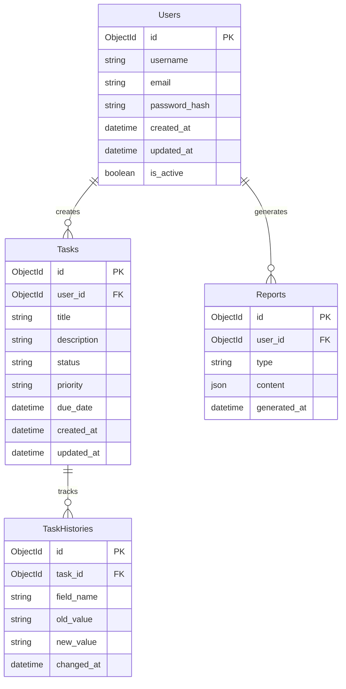

# 📋 TodoIng - 现代化任务管理系统

<div align="center">


**TodoIng** 是一个基于 Golang 后端和 React 前端的现代化任务管理系统，提供完整的任务生命周期管理、团队协作、报告生成和 AI 智能助手功能。

[](https://opensource.org/licenses/MIT)
[](https://golang.org/)
[](https://reactjs.org/)
[](https://www.typescriptlang.org/)
[](https://docker.com/)

</div>

## ✨ 功能特性

## 🔍 当前缺陷与计划概览

> 详见 `docs/OPTIMIZATION_PLAN.md` 获取分阶段路线图与任务看板。

### 已完成 (Phase 0 部分)

- Unified 聚合：upcoming / calendar 支持 sources & limit
- 安全修复：普通任务聚合缺失 userID 过滤补齐
- server_timestamp 字段（延迟评估基础）
- 全局反馈：ToastProvider / GlobalErrorBoundary / SkeletonList 基础
- 去重：移除 Events / Reminders 页面独立 upcoming 侧栏

### 进行中 / 下一步

1. DataState 集成骨架占位（替换 spinner）
2. Dashboard / Reminders / Events 统一过滤栏设计（sources/hours/limit/severity）
3. 后端 UnifiedService 单元测试 scaffold
4. README/Docs：Architecture & Severity 文档初稿
5. 预研：RTK Query 缓存策略（stale 30s + 前台 refetch）

> 目标：首屏聚合可见时间 < 1.5s，后端服务聚合逻辑测试覆盖率 60%。

### 🎯 核心功能

- [x] **用户认证系统** - JWT 令牌认证，邮箱验证码登录/注册
- [x] **任务管理** - 完整的 CRUD 操作，状态管理，优先级设置
- [x] **任务历史追踪** - Git 风格的变更历史记录
- [x] **团队协作** - 多用户支持，权限管理
- [x] **报告生成** - 自动生成日报、周报、月报
- [x] **AI 智能助手** - OpenAI 集成的报告润色功能
- [x] **数据可视化** - 任务统计图表和进度展示
- [x] **多语言支持** - 国际化 i18n 支持

### 🔐 安全特性

- [x] **图形验证码** - 防机器人注册和登录
- [x] **邮箱验证** - 邮箱验证码系统
- [x] **JWT 认证** - 安全的令牌认证机制
- [x] **密码加密** - Bcrypt 密码哈希
- [x] **CORS 保护** - 跨域请求安全策略
- [x] **Rate Limiting** - API 访问频率限制

### 🚀 开发特性

- [x] **容器化部署** - Docker 和 Docker Compose 支持
- [x] **API 文档** - 自动生成的 Swagger 文档
- [x] **类型安全** - TypeScript 前端，Go 类型安全后端
- [x] **gRPC 支持** - 高性能的 gRPC 服务
- [x] **可观测性** - 结构化日志和监控
- [x] **热重载** - 开发环境自动重载
- [x] **单元测试** - 完整的测试覆盖

## 🏗️ 技术架构

### 系统架构图

```mermaid
graph TB
    subgraph "前端层"
        A[React + TypeScript]
        B[Redux Toolkit]
        C[Vite 构建工具]
    end
    
    subgraph "API 层"
        D[Nginx 反向代理]
        E[SSL/TLS 加密]
    end
    
    subgraph "后端层"
        F[Golang HTTP Server]
        G[gRPC 服务]
        H[JWT 认证]
    end
    
    subgraph "数据层"
        I[MongoDB 数据库]
        J[Redis 缓存]
    end
    
    A --> D
    B --> A
    C --> A
    D --> F
    E --> D
    F --> H
    G --> H
    H --> I
    F --> J
    G --> I
```



### 🎨 前端技术栈

| 技术 | 版本 | 用途 |
|------|------|------|
| React | 18+ | 用户界面框架 |
| TypeScript | 5+ | 类型安全的 JavaScript |
| Redux Toolkit | 2+ | 状态管理 |
| React Router | 6+ | 路由管理 |
| Vite | 5+ | 构建工具和开发服务器 |
| Axios | 1+ | HTTP 客户端 |

### ⚙️ 后端技术栈

| 技术 | 版本 | 用途 |
|------|------|------|
| Golang | 1.23+ | 后端开发语言 |
| Gin/Echo | Latest | Web 框架 |
| gRPC | Latest | 高性能 RPC 框架 |
| JWT | Latest | 身份认证 |
| MongoDB | 7+ | 主数据库 |
| Redis | 7+ | 缓存和会话存储 |

### 🗄️ 数据库设计



```text
┌─────────────────┐    ┌─────────────────┐    ┌─────────────────┐
│   React 前端    │────│   Golang 后端   │────│   MongoDB       │
│                 │    │                 │    │   数据库        │
│ • TypeScript    │    │ • RESTful API   │    │                 │
│ • Redux Toolkit │    │ • gRPC 服务     │    │ • 任务数据      │
│ • Bootstrap 5   │    │ • JWT 认证      │    │ • 用户数据      │
│ • Vite 构建     │    │ • 邮件服务      │    │ • 报告数据      │
└─────────────────┘    └─────────────────┘    └─────────────────┘
         │                       │                       │
         └───────────────────────┼───────────────────────┘
                                 │
                    ┌─────────────────┐
                    │   第三方服务    │
                    │                 │
                    │ • OpenAI API    │
                    │ • 邮件服务      │
                    │ • 对象存储      │
                    └─────────────────┘
```

### 🎨 前端技术栈

| 技术 | 版本 | 用途 |
|------|------|------|
| **React** | 18+ | 用户界面框架 |
| **TypeScript** | 5+ | 类型安全的 JavaScript |
| **Redux Toolkit** | 1.9+ | 状态管理 |
| **React Router** | v6 | 路由管理 |
| **Bootstrap** | 5+ | UI 组件库 |
| **Vite** | 4+ | 构建工具 |
| **Axios** | 1.4+ | HTTP 客户端 |
| **i18next** | 22+ | 国际化支持 |

### ⚙️ Golang 后端技术栈

| 技术 | 版本 | 用途 |
|------|------|------|
| **Go** | 1.23+ | 主要编程语言 |
| **Gorilla Mux** | 1.8+ | HTTP 路由器 |
| **MongoDB Driver** | 1.15+ | 数据库驱动 |
| **JWT-Go** | 5.2+ | JWT 令牌处理 |
| **gRPC** | 1.74+ | 高性能 RPC 框架 |
| **Protobuf** | 1.36+ | 序列化协议 |
| **Swagger** | 1.16+ | API 文档生成 |
| **Gin** | 1.10+ | Web 框架 (可选) |

### 🗄️ 数据库设计
```
📦 MongoDB 集合结构
├── 👤 users          # 用户信息
├── 📋 tasks          # 任务数据
├── 📊 reports        # 报告数据
├── 🔑 tokens         # 认证令牌
└── 📧 email_codes    # 邮箱验证码
```

## 🐳 Docker 部署方案

我们提供了**5种不同的 Docker 部署方案**，满足从开发到生产的各种需求：

| 🎯 场景 | 📁 配置文件 | 🚀 快速启动 | 📝 说明 |
|---------|------------|-------------|---------|
| 🔵 **Golang 生产** | `docker/docker-compose.golang.yml` | `./docker/deploy.sh golang up` | **推荐生产方案**，性能优秀，包含 gRPC + 监控 |
| 🟢 **Node.js 生产** | `docker/docker-compose.nodejs.yml` | `./docker/deploy.sh nodejs up` | 传统部署，快速上手 |
| 🛠️ **开发环境** | `docker/docker-compose.dev-full.yml` | `./docker/deploy.sh dev up` | 完整开发工具，热重载 + 调试 |
| 🚀 **企业生产** | `docker/docker-compose.prod.yml` | `./docker/deploy.sh prod up` | 企业级高可用，SSL + 监控 + 备份 |
| 🏗️ **微服务架构** | `docker/docker-compose.microservices.yml` | `./docker/deploy.sh micro up` | 大型项目，API网关 + 服务发现 |

### 🎯 一键部署体验

```bash
# 🔥 60秒极速体验 - 推荐 Golang 方案
git clone https://github.com/axfinn/todoIng.git
cd todoIng/docker
cp .env.example .env
./deploy.sh golang up

# 🎉 部署完成！访问：
# 📱 应用地址: http://localhost  
# 🔗 API 接口: http://localhost:5004/api
# 📚 API 文档: http://localhost:5004/swagger/
```

### 🛠️ 开发调试环境

```bash
# 启动完整开发环境 (包含数据库管理工具、邮件测试等)
./docker/deploy.sh dev up --profile golang

# 🎯 开发工具访问地址：
# 🌐 前端开发: http://localhost:3000 (热重载)
# 🗄️ 数据库管理: http://localhost:8081 (Mongo Express)
# 📮 邮件测试: http://localhost:8025 (MailHog)
# 📊 Redis 管理: http://localhost:8082
```

### 🚀 生产部署

```bash
# 企业级生产环境 (SSL + 负载均衡 + 监控)
./docker/deploy.sh prod up --profile replica

# 🎯 监控访问地址：
# 📊 监控面板: http://localhost:3001 (Grafana)
# 🎯 应用地址: https://your-domain.com
```

**💡 详细的 Docker 部署文档请查看：[docker/README.md](./docker/README.md)**

---

## 🚀 快速开始

### 📋 环境要求

- **Docker** 20+ 和 **Docker Compose** 2.0+ (推荐方式)
- 或者 **Node.js** 18+ / **Go** 1.23+ + **MongoDB** 5.0+ (本地开发)

### 🐳 Docker 部署 (推荐)

**最简单的启动方式 - 适合体验和生产使用：**

```bash
# 1. 克隆项目
git clone https://github.com/axfinn/todoIng.git
cd todoIng

# 2. 进入 Docker 目录
cd docker

# 3. 配置环境变量
cp .env.example .env
# 💡 推荐：编辑 .env 文件，至少设置 JWT_SECRET 和邮箱配置

# 4. 一键启动 (推荐 Golang 方案)
./deploy.sh golang up

# 🎉 部署完成！访问地址：
# 📱 前端应用: http://localhost
# 🔗 API 接口: http://localhost:5004/api  
# 📚 API 文档: http://localhost:5004/swagger/
```

**更多部署方案：**

```bash
# 🟢 Node.js 方案
./deploy.sh nodejs up

# 🛠️ 开发环境 (包含调试工具)
./deploy.sh dev up --profile golang

# 🚀 生产环境 (包含监控和备份)
./deploy.sh prod up

# 🏗️ 微服务架构 (适合大型项目)
./deploy.sh micro up
```

**💡 详细配置和说明请查看：[docker/README.md](./docker/README.md)**

---

### 💻 本地开发部署

如果您需要进行代码开发或不使用 Docker，可以按以下方式本地部署：

#### 后端部署 (Go 版本)
```bash
# 1. 进入 Go 后端目录
cd backend-go

# 2. 安装依赖
go mod download

# 3. 配置环境变量
cp .env.example .env

# 4. 生成 API 文档
make docs

# 5. 启动服务
make run
# 或直接运行: go run ./cmd/api/main.go

# 6. 验证服务
curl http://localhost:5004/health
```

#### 前端部署
```bash
# 1. 进入前端目录
cd frontend

# 2. 安装依赖
npm install

# 3. 启动开发服务器
npm run dev

# 4. 访问应用
open http://localhost:5173
```

#### 数据库启动
```bash
# 使用 Docker 启动 MongoDB
docker-compose -f docker-compose.dev.yml up mongodb -d

# 或使用本地 MongoDB
mongod --dbpath ./data/db
```

## 📖 项目文档

### 📚 开发文档
- [🚀 开发计划](./docs/development/development-plan.md)
- [🏗️ 技术设计](./docs/technical-design.md)
- [🗄️ 数据库设计](./docs/database-design.md)
- [🔌 API 设计](./docs/api-design.md)
- [🎨 UI/UX 设计](./docs/ui-ux-design.md)

### ⚙️ 运维文档
- [⚙️ 配置管理](./docs/configuration.md)
- [🐳 Docker 部署总览](./docker/README.md) - 完整的 Docker 部署方案
- [🐳 Golang 镜像使用](./backend-go/DOCKER.md) - Golang 后端镜像详细指南
- [📊 监控运维](./docs/observability.md)

### 🔧 API 文档
- **Swagger UI**: http://localhost:5004/swagger/
- **完整 API 文档**: http://localhost:5004/api-docs
- **gRPC 文档**: [查看 Proto 文件](./backend-go/api/proto/v1/)

## 🛠️ 开发工具

### Go 后端开发
```bash
# 查看所有可用命令
make help

# 生成 API 文档
make docs

# 构建项目
make build

# 运行测试
make test

# 代码格式化
make fmt

# 代码检查
make lint

# 清理构建文件
make clean
```

### 项目结构
```
todoIng/
├── 📁 frontend/          # React 前端应用
│   ├── src/
│   │   ├── components/   # 可复用组件
│   │   ├── pages/        # 页面组件
│   │   ├── store/        # Redux 状态管理
│   │   ├── utils/        # 工具函数
│   │   └── locales/      # 国际化文件
│   ├── public/           # 静态资源
│   └── package.json
│
├── 📁 backend-go/        # Go 后端服务 (推荐)
│   ├── cmd/              # 应用入口
│   │   ├── api/          # HTTP API 服务
│   │   └── grpc/         # gRPC 服务
│   ├── internal/         # 内部代码
│   │   ├── api/          # API 处理器
│   │   ├── models/       # 数据模型
│   │   ├── services/     # 业务逻辑
│   │   └── config/       # 配置管理
│   ├── api/proto/        # Protobuf 定义
│   ├── docs/             # API 文档
│   ├── tools/            # 开发工具
│   └── Makefile          # 构建脚本
│
├── 📁 backend/           # Node.js 后端 (维护中)
│   ├── src/
│   │   ├── controllers/  # 控制器
│   │   ├── models/       # 数据模型
│   │   ├── routes/       # 路由定义
│   │   ├── middleware/   # 中间件
│   │   └── utils/        # 工具函数
│   └── package.json
│
├── 📁 docs/              # 项目文档
│   ├── api-design.md     # API 设计文档
│   ├── database-design.md # 数据库设计
│   └── development/      # 开发相关文档
│
├── 📁 img/               # 项目图片资源
├── 🐳 docker-compose.yml # Docker 编排文件
└── 📄 README.md          # 项目说明
```

## ⚙️ 环境配置

### 环境变量配置
```bash
# 数据库配置
MONGODB_URI=mongodb://localhost:27017/todoing
DB_NAME=todoing

# JWT 配置
JWT_SECRET=your-super-secret-jwt-key
JWT_EXPIRES_IN=7d

# 邮件服务配置
SMTP_HOST=smtp.gmail.com
SMTP_PORT=587
SMTP_USER=your-email@gmail.com
SMTP_PASS=your-app-password

# OpenAI 配置 (报告 AI 润色)
OPENAI_API_KEY=sk-your-openai-api-key
OPENAI_MODEL=gpt-3.5-turbo

# 应用配置
NODE_ENV=development
PORT=5004
FRONTEND_URL=http://localhost:5173

# 功能开关
ENABLE_CAPTCHA=true
ENABLE_EMAIL_VERIFICATION=true
DISABLE_REGISTRATION=false
```

### 功能开关说明
| 环境变量 | 默认值 | 说明 |
|----------|--------|------|
| `ENABLE_CAPTCHA` | `false` | 启用图形验证码 |
| `ENABLE_EMAIL_VERIFICATION` | `false` | 启用邮箱验证码 |
| `DISABLE_REGISTRATION` | `false` | 禁用用户注册 |
| `DEBUG_MODE` | `false` | 启用调试模式 |

## 🔌 API 接口

### REST API 端点
```
📋 任务管理
├── GET    /api/tasks           # 获取任务列表
├── POST   /api/tasks           # 创建新任务
├── GET    /api/tasks/:id       # 获取任务详情
├── PUT    /api/tasks/:id       # 更新任务
├── DELETE /api/tasks/:id       # 删除任务
├── GET    /api/tasks/export    # 导出任务
└── POST   /api/tasks/import    # 导入任务

👤 用户认证
├── POST   /api/auth/register      # 用户注册
├── POST   /api/auth/login         # 用户登录
├── GET    /api/auth/me            # 获取用户信息
├── POST   /api/auth/send-code     # 发送验证码
└── GET    /api/auth/captcha       # 获取图形验证码

📊 报告管理
├── GET    /api/reports            # 获取报告列表
├── POST   /api/reports/generate   # 生成报告
├── POST   /api/reports/:id/polish # AI 润色报告
└── GET    /api/reports/:id/export # 导出报告
```

### gRPC 服务
```
🔗 gRPC 服务端点
├── AuthService          # 认证服务
│   ├── Login           # 用户登录
│   └── Register        # 用户注册
├── TaskService          # 任务服务
│   ├── CreateTask      # 创建任务
│   ├── ListTasks       # 任务列表
│   └── UpdateTask      # 更新任务
└── ReportService        # 报告服务
    ├── GenerateReport  # 生成报告
    └── PolishReport    # 润色报告
```

## 🧪 测试

### 运行测试
```bash
# Go 后端测试
cd backend-go
make test                # 运行所有测试
make test-unit          # 运行单元测试
make test-coverage      # 生成覆盖率报告

# 前端测试
cd frontend
npm run test            # 运行前端测试
npm run test:coverage   # 生成覆盖率报告
```

### API 测试
```bash
# 健康检查
curl http://localhost:5004/health

# 获取验证码
curl http://localhost:5004/api/auth/captcha

# 用户注册
curl -X POST http://localhost:5004/api/auth/register \
  -H "Content-Type: application/json" \
  -d '{"email":"test@example.com","password":"123456","nickname":"测试用户"}'
```

## 🚀 部署方案

### 🐳 Docker 生产部署
```bash
# 构建生产镜像
docker-compose -f docker-compose.yml build

# 启动生产环境
docker-compose -f docker-compose.yml up -d

# 查看服务状态
docker-compose ps

# 查看日志
docker-compose logs -f
```

### ☁️ 云平台部署
- **前端**: Vercel, Netlify, 或 CDN
- **后端**: AWS ECS, Google Cloud Run, 或 Kubernetes
- **数据库**: MongoDB Atlas, AWS DocumentDB
- **文件存储**: AWS S3, 阿里云 OSS

## 📊 性能指标

### 系统性能
- **响应时间**: < 200ms (API 平均响应)
- **并发用户**: 1000+ (经过测试)
- **数据库**: 10,000+ 任务记录
- **文件上传**: 支持 10MB 文件

### 浏览器兼容性
- ✅ Chrome 90+
- ✅ Firefox 88+
- ✅ Safari 14+
- ✅ Edge 90+
- ✅ 移动端浏览器

## 🤝 贡献指南

### 开发流程
1. **Fork** 项目到你的 GitHub 账户
2. **创建分支**: `git checkout -b feature/your-feature-name`
3. **提交更改**: `git commit -am 'Add some feature'`
4. **推送分支**: `git push origin feature/your-feature-name`
5. **创建 Pull Request**

### 代码规范
- **Go**: 遵循 `gofmt` 和 `golint` 规范
- **TypeScript**: 使用 ESLint 和 Prettier
- **提交信息**: 遵循 [Conventional Commits](https://conventionalcommits.org/)

### 问题反馈
- 🐛 **Bug 反馈**: [创建 Issue](https://github.com/axfinn/todoIng/issues/new?template=bug_report.md)
- 💡 **功能建议**: [功能请求](https://github.com/axfinn/todoIng/issues/new?template=feature_request.md)
- 📚 **文档改进**: [文档 Issue](https://github.com/axfinn/todoIng/issues/new?template=documentation.md)

## 📜 许可证

本项目采用 [MIT 许可证](LICENSE) - 查看 LICENSE 文件了解详情。

## 🙏 致谢

感谢以下开源项目和社区：
- [React](https://reactjs.org/) - 用户界面库
- [Go](https://golang.org/) - 编程语言
- [MongoDB](https://www.mongodb.com/) - 数据库
- [Docker](https://www.docker.com/) - 容器化平台
- [OpenAI](https://openai.com/) - AI 服务

## 📞 联系方式

- **项目主页**: https://github.com/axfinn/todoIng
- **问题反馈**: https://github.com/axfinn/todoIng/issues
- **邮箱**: axfinn@example.com

---

<div align="center">

**⭐ 如果这个项目对你有帮助，请给我们一个 Star！**

Made with ❤️ by [axfinn](https://github.com/axfinn)

</div>

### 使用 Docker Hub 镜像

```
# 拉取镜像
docker pull axiu/todoing:latest
docker pull axiu/todoing-frontend:latest

# 运行服务
docker-compose -f docker-compose.local.yml up -d
```

#### 开发环境部署
```
# 克隆项目
git clone <repository-url>
cd todoIng

# 构建并启动开发环境
docker-compose -f docker-compose.dev.yml up -d

# 应用将在以下地址可用：
# 前端: http://localhost:3000
# 后端API: http://localhost:5001
```

### 功能说明

#### 登录验证码功能
系统支持可选的登录验证码功能，以增强安全性。当 `ENABLE_CAPTCHA=true`（后端）和 `VITE_ENABLE_CAPTCHA=true`（前端）时，登录界面会显示验证码输入框和获取验证码按钮。

用户需要先点击"获取验证码"按钮，然后输入显示的验证码进行登录。

#### 注册控制功能
系统支持通过环境变量控制是否允许新用户注册。当 `DISABLE_REGISTRATION=true` 时，注册接口将被禁用，新用户无法通过常规注册流程创建账户。

#### 邮箱验证码功能
系统支持邮箱验证码登录和注册功能，提供更灵活的认证方式：

1. **注册时邮箱验证码**：
   - 用户在注册时需要提供邮箱地址并获取验证码
   - 输入收到的验证码完成注册流程
   - 可与图片验证码同时使用以增强安全性

2. **登录时邮箱验证码**：
   - 用户可以选择使用邮箱验证码登录而无需密码
   - 点击"邮箱验证码登录"切换登录方式
   - 获取并输入验证码即可登录

要启用邮箱验证码功能，需要设置以下环境变量：
- 后端：`ENABLE_EMAIL_VERIFICATION=true`
- 前端：`VITE_ENABLE_EMAIL_VERIFICATION=true`
- 邮件服务器配置（`EMAIL_HOST`, `EMAIL_PORT`, `EMAIL_USER`, `EMAIL_PASS`等）

### 方法二：手动部署

#### 后端设置
```
# 进入后端目录
cd backend

# 安装依赖
npm install

# 创建.env文件并配置环境变量
cp .env.example .env
# 编辑.env文件，设置MONGO_URI和JWT_SECRET

# 启动后端服务
npm start
# 或者开发模式
npm run dev
```

#### 前端设置
```
# 进入前端目录
cd frontend

# 安装依赖
npm install

# 创建.env文件并配置环境变量
cp .env.example .env
# 编辑.env文件，设置VITE_API_URL

# 启动前端开发服务器
npm run dev

# 或者构建生产版本
npm run build
```

## 部署

应用支持多种部署方式：
1. Docker 容器化部署
2. 传统部署方式

详细部署说明请参考 [部署文档](./docs/deployment.md)。

## Docker 自动构建

本项目使用 GitHub Actions 实现 Docker 镜像的自动构建和推送。每当有新的 Git 标签创建时，GitHub Actions 会自动构建 Docker 镜像并推送到 Docker Hub。

### 配置自动构建

要为你的 fork 配置自动构建，需要在 GitHub 仓库中设置以下 Secrets:

1. `DOCKERHUB_USERNAME` - 你的 Docker Hub 用户名
2. `DOCKERHUB_TOKEN` - 你的 Docker Hub 访问令牌

生成 Docker Hub 访问令牌的步骤:
1. 登录到 [Docker Hub](https://hub.docker.com/)
2. 进入 Account Settings（账户设置）
3. 点击 Security（安全）选项卡
4. 点击 "New Access Token"（新建访问令牌）
5. 为令牌添加描述（例如："GitHub Actions"）
6. 选择适当的权限（通常选择 Read & Write）
7. 点击 "Generate"（生成）
8. 复制生成的令牌并将其作为 `DOCKERHUB_TOKEN` Secret 添加到 GitHub

## 版本更新日志

### v1.8.6 (2025-08-05)
- 新增邮箱验证码注册功能
- 新增邮箱验证码登录功能
- 改进注册页面用户体验，支持仅使用邮箱验证码注册
- 改进登录页面用户体验，支持切换密码登录和邮箱验证码登录
- 优化验证码处理逻辑，邮箱验证码登录时不需要图片验证码
- 修复注册和登录接口验证逻辑问题

### v1.8.5 (2025-08-03)
- 修复语言切换功能无反应问题
- 修复语言切换下拉菜单显示问题
- 更新文档和添加收款码信息

(历史版本信息省略)

## 请作者喝咖啡

如果你觉得这个项目对你有帮助，欢迎请作者喝杯咖啡！

<div style="display: flex; gap: 20px;">
  <div>
    <h4>支付宝</h4>
    
  </div>
  <div>
    <h4>微信支付</h4>
    
  </div>
</div>

## 贡献

欢迎提交 Issue 和 Pull Request 来帮助改进项目。

## 许可证

[MIT](./LICENSE)