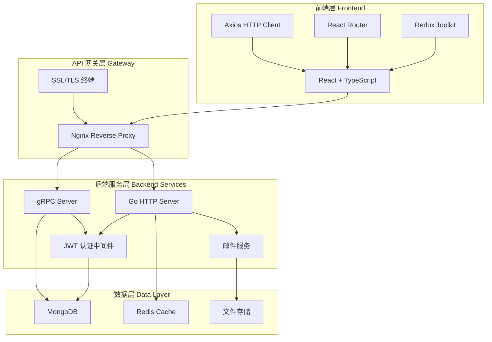
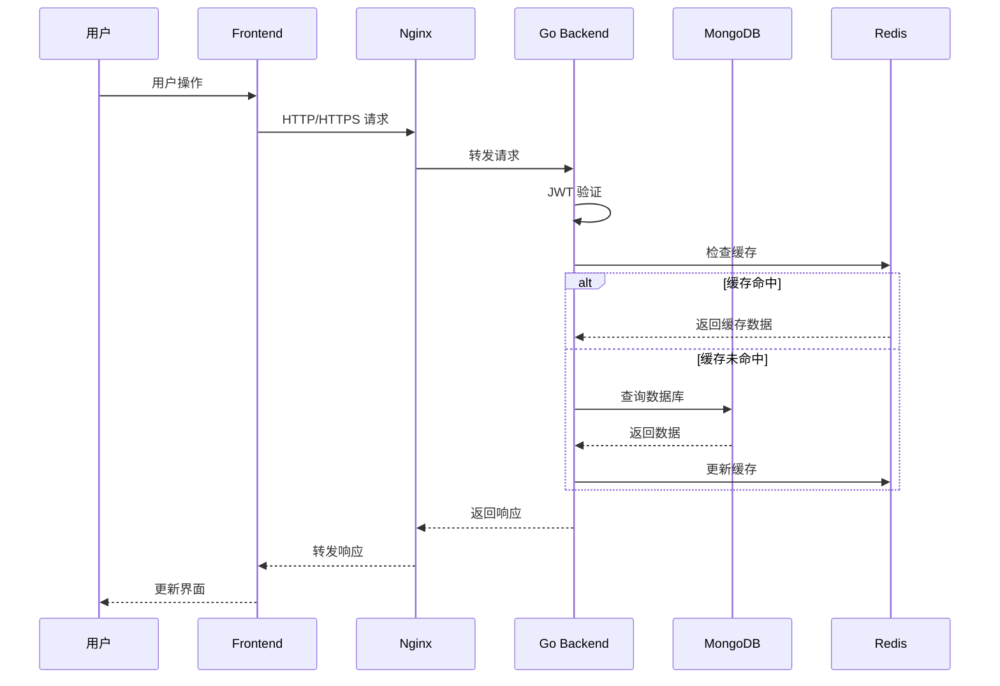
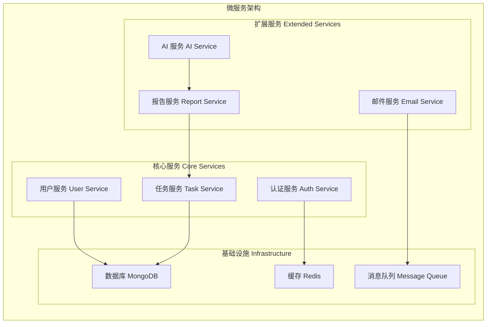
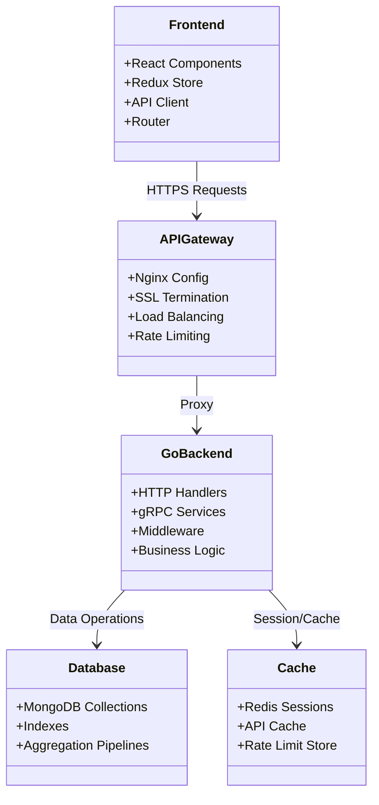
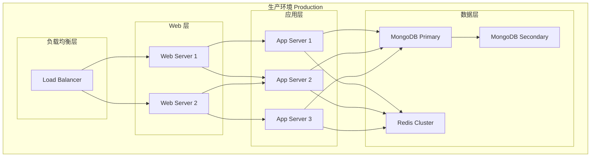
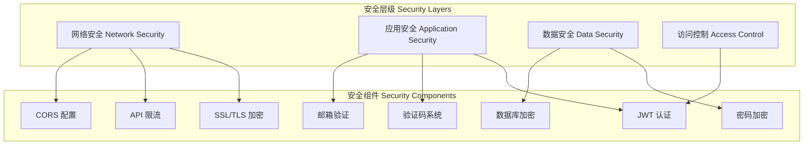
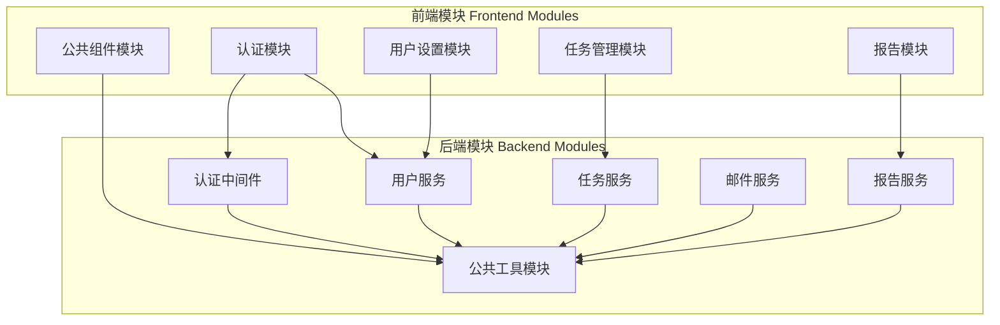
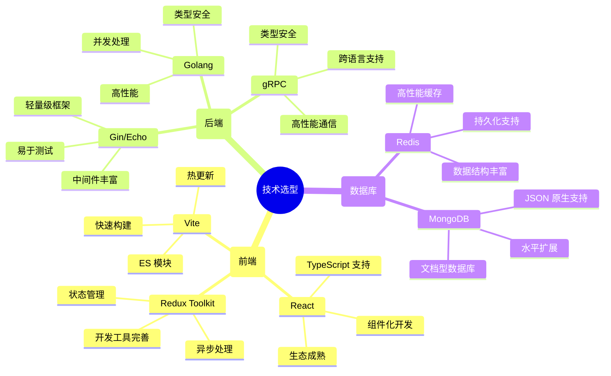

# 📐 TodoIng 系统架构设计

## 🏗️ 整体架构



## 🔄 数据流图



## 🏢 服务架构



## 📊 组件关系图



## 🌐 部署架构



## 🔐 安全架构



## 📦 模块依赖图



## 🔄 开发流程图

```mermaid
gitgraph
    commit id: "初始化项目"
    branch dev
    checkout dev
    commit id: "Golang 后端重构"
    commit id: "移除 Node.js 依赖"
    branch feature/auth
    checkout feature/auth
    commit id: "实现 JWT 认证"
    commit id: "添加邮箱验证"
    checkout dev
    merge feature/auth
    branch feature/tasks
    checkout feature/tasks
    commit id: "任务 CRUD 操作"
    commit id: "任务历史追踪"
    checkout dev
    merge feature/tasks
    branch feature/reports
    checkout feature/reports
    commit id: "报告生成功能"
    commit id: "AI 集成"
    checkout dev
    merge feature/reports
    checkout main
    merge dev
    commit id: "v2.0.0 发布"
```

## 🚀 技术选型理由



## 📈 性能指标

```mermaid
xychart-beta
    title "系统性能指标"
    x-axis [响应时间, 并发用户, 数据吞吐, 可用性]
    y-axis "指标值" 0 --> 100
    bar [95, 80, 90, 99.9]
```
