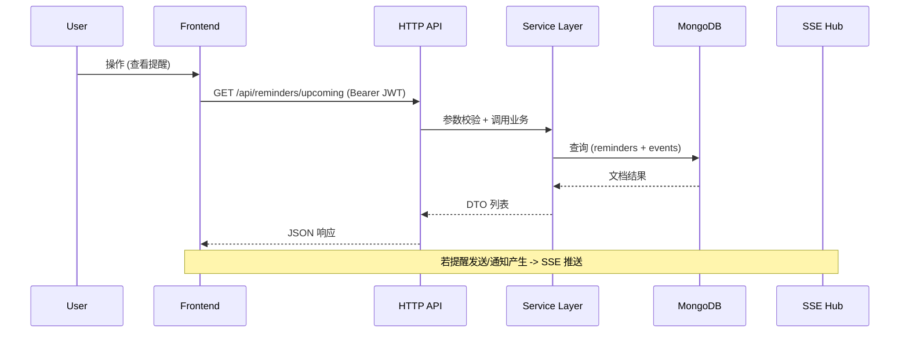
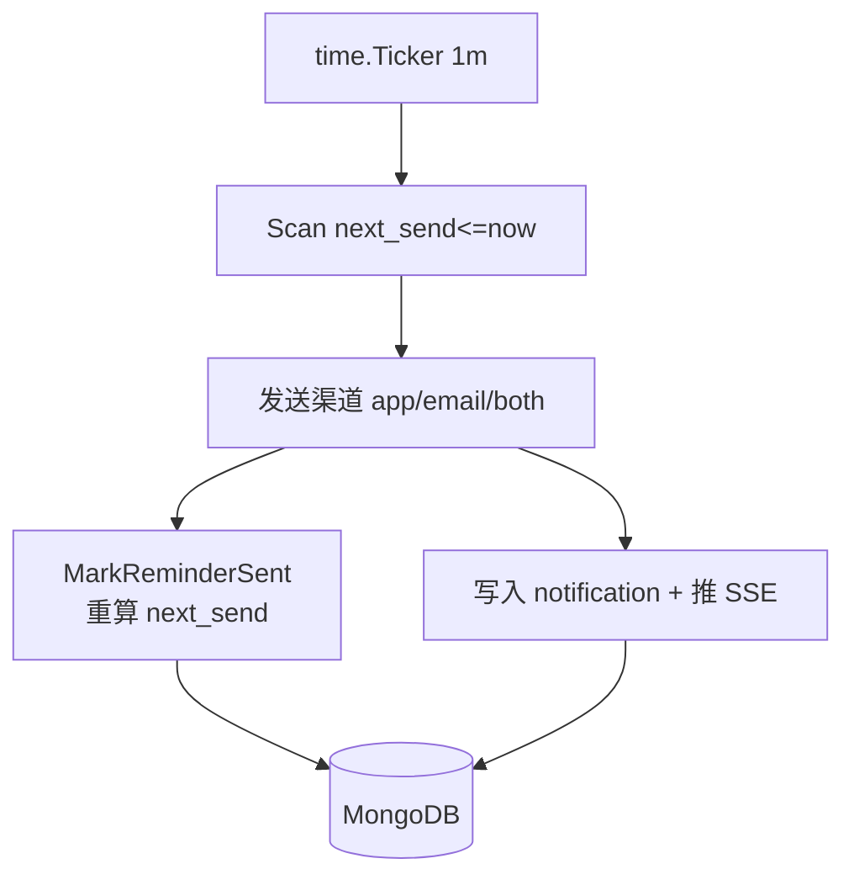

# TodoIng 架构概览 (当前 dev 实现)

> 本文档已清理旧版中与现状不符的微服务、Redis、消息队列、文件存储等描述；当前代码为**单体 Golang HTTP 服务 + 前端 React 应用 + MongoDB**，含可选邮件发送与 SSE 通知。

## 1. 总览

```mermaid
flowchart LR
  subgraph Frontend
    FE[React + TS\nVite + RTK]
  end
  subgraph Backend(Golang Monolith)
    API[HTTP API (mux)]
    AUTH[Auth/JWT]
    TASK[Tasks]
    EVENT[Events]
    REM[Reminders\nScheduler]
    REP[Reports]
    UNI[Unified Aggregation]
    NOTI[Notifications\nSSE Hub]
    OBS[Observability\n(logger + tracing)]
  end
  DB[(MongoDB)]
  EMAIL[(SMTP / Mail)]

  FE -->|REST / JSON| API
  API --> AUTH
  API --> TASK
  API --> EVENT
  API --> REM
  API --> REP
  API --> UNI
  API --> NOTI
  TASK --> DB
  EVENT --> DB
  REM --> DB
  REP --> DB
  UNI --> DB
  AUTH --> DB
  NOTI --> DB
  REM --> EMAIL
  FE <-->|SSE (notifications)| NOTI
```

## 2. 主要后端模块 (internal/*)

| 模块 | 说明 |
|------|------|
| `api` | HTTP 路由 & Handlers (auth, tasks, events, reminders, reports, dashboard, unified, notifications) |
| `models` | 数据模型 (User, Task, Event, Reminder, Report, Notification, Aggregation DTO) |
| `services` | 业务逻辑：任务、事件、提醒 (含调度器)、报告、通知、统一聚合等 |
| `auth` | JWT 签发 / 解析 |
| `email` | 邮件发送封装（支持提醒/验证码；提醒优先使用 REMINDER_EMAIL_* 覆盖） |
| `captcha` | 验证码存储与校验 (可选) |
| `notifications` | SSE Hub + 推送通知创建 |
| `observability` | 日志 + Tracer 初始化 |

## 3. 典型请求流程



## 4. 提醒调度与通知



要点:

- 调度器独立 goroutine，每分钟扫描 `{is_active: true, next_send: {$lte: now}}`。
- 发送成功后更新 `last_sent` 并重算 `next_send`（一次性事件通常置空）。
- 通过 `notifications.Hub` 推送 SSE，前端实时刷新。

## 5. 数据存储 (见 `database-design.md` 详情)

当前集合：`users`, `tasks`, `events`, `reminders`, `reports`, `notifications`。未实现：团队 / 历史版本 / 统计聚合表等。

## 6. 认证与安全

- JWT (HS256) 放置 `Authorization: Bearer <token>`
- 可选功能旗标：`ENABLE_CAPTCHA`, `ENABLE_EMAIL_VERIFICATION`, `DISABLE_REGISTRATION`
- 创建默认用户：读取 `DEFAULT_USERNAME / DEFAULT_PASSWORD / DEFAULT_EMAIL`
- 参数宽松解析 + 严格回退日志机制（例如 CreateReminder）

## 7. 前端交互要点

- 使用 Redux Toolkit (features/*) 模块：auth, tasks, events, reminders, unified, notifications, dashboard。
- SSE 连接用于接收服务器端事件（通知推送 / 后续实时扩展）。
- Reminders 支持测试接口 `/api/reminders/test` 实时邮件尝试。

## 8. 与旧文档差异摘要

| 旧描述 | 现状 | 处理 |
|--------|------|------|
| 微服务/多个核心服务 | 单体 + 模块化 packages | 已移除相关图示 |
| Redis 缓存 | 未实现 (计划中) | 移除主流程，仅在优化计划保留 |
| 消息队列 | 未实现 | 删除 |
| 文件存储 / 对象存储 | 未实现 | 删除 |
| 复杂任务历史/团队/统计集合 | 未实现 | 从数据库设计文档中移除 |
| 负载均衡/多副本部署图 | 当前单实例（可 Docker） | 删除过度设计示意 |

## 9. 未来扩展占位 (不影响当前实现)

- Redis 短 TTL 缓存统一聚合结果
- SSE -> WebSocket 扩展 (需要客户端更多交互)
- 指标 & Prometheus 采集
- 任务/事件团队协作与历史审计

---

最后更新：自动同步至 dev 分支当前代码结构。
