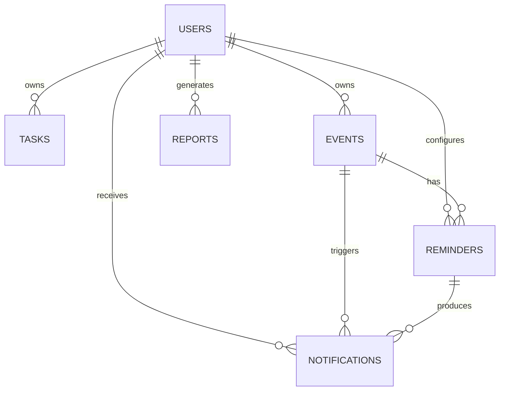

# 数据库设计 (当前 dev 实现)

> 已清理未实现的团队(teams)、任务历史(task_histories)、用户统计(user_statistics)、任务总结(task_summaries)等集合描述；以下仅保留代码真实存在并被使用的集合结构。

## 概述

使用 MongoDB 作为主数据存储。集合简单，围绕用户、任务、事件、提醒、报告、通知六类主体。所有时间统一使用 UTC 存储，前端负责本地化显示。

## 集合一览

| 集合 | 说明 | 关键索引建议 |
|------|------|--------------|
| `users` | 用户登录/认证基础信息 | `username`(唯一), `email`(唯一) |
| `tasks` | 用户任务 | `createdBy`, `status`, `priority`, `deadline`, `scheduledDate` |
| `events` | 事件（含循环/重要级） | `user_id`, `event_date`, `recurrence_type` |
| `reminders` | 提醒规则 (与事件关联) | `{user_id, is_active, next_send}`, `event_id` |
| `reports` | 用户报告/统计快照 | `userId`, `type`, `createdAt` |
| `notifications` | 应用内通知 + SSE 推送来源 | `user_id`, `type`, `created_at` |

---

## 1. users

```jsonc
{
  "_id": ObjectId,
  "username": String,
  "email": String,
  "password": String,        // bcrypt hash
  "createdAt": Date
}
```

## 2. tasks

对应 `internal/models/task.go`。

```jsonc
{
  "_id": ObjectId | String,   // 当前模型使用 string 形式序列化
  "title": String,
  "description": String,
  "status": String,           // 例如: pending / in_progress / completed
  "priority": String,         // 可选: low / medium / high
  "assignee": String|null,    // (预留) 当前多为创建者自己
  "createdBy": String,        // user id
  "createdAt": Date,
  "updatedAt": Date,
  "deadline": Date|null,
  "scheduledDate": Date|null,
  "comments": [{
     "text": String,
     "createdBy": String,
     "createdAt": Date
  }]
}
```

索引建议：

- `{ createdBy: 1, createdAt: -1 }` 最近任务列表
- `{ createdBy: 1, status: 1 }` 状态过滤
- `{ createdBy: 1, deadline: 1 }` 即将到期排序

## 3. events

对应 `internal/models/event.go`。

```jsonc
{
  "_id": ObjectId,
  "user_id": ObjectId,
  "title": String,
  "description": String,
  "event_type": String,          // birthday / anniversary / holiday / custom / meeting / deadline
  "event_date": Date,
  "recurrence_type": String,     // none / yearly / monthly / weekly / daily
  "recurrence_config": Object|null,
  "importance_level": Number,    // 1..5
  "tags": [String],
  "location": String|null,
  "is_all_day": Boolean,
  "is_active": Boolean,
  "last_triggered_at": Date|null,
  "created_at": Date,
  "updated_at": Date
}
```

索引建议：

- `{ user_id: 1, event_date: 1 }`
- `{ user_id: 1, is_active: 1 }`

## 4. reminders

对应 `internal/models/reminder.go`。

```jsonc
{
  "_id": ObjectId,
  "event_id": ObjectId,
  "user_id": ObjectId,
  "advance_days": Number,        // >=0
  "reminder_times": ["HH:MM"],  // 与 advance_days 组合
  "absolute_times": [Date]? ,    // (可选) 直接指定绝对时间优先级更高
  "reminder_type": "app"|"email"|"both",
  "custom_message": String|null,
  "is_active": Boolean,
  "last_sent": Date|null,
  "next_send": Date|null,
  "created_at": Date,
  "updated_at": Date
}
```

索引（实际调度关键路径）：

- `{ is_active: 1, next_send: 1 }` 供调度器扫描
- `{ user_id: 1, event_id: 1 }`

## 5. reports

对应 `internal/models/report.go`。

```jsonc
{
  "_id": ObjectId | String,
  "userId": String,
  "type": String,              // daily / weekly / monthly / custom
  "period": String,            // 与 type 结合使用（当前实现中保留原字段名）
  "title": String,
  "content": String,
  "polishedContent": String|null,
  "tasks": [String],           // 关联任务ID列表
  "statistics": {
     "totalTasks": Number,
     "completedTasks": Number,
     "inProgressTasks": Number,
     "overdueTasks": Number,
     "completionRate": Number
  },
  "createdAt": Date,
  "updatedAt": Date
}
```

索引建议：`{ userId: 1, createdAt: -1 }`。

## 6. notifications

对应 `internal/models/notification.go`。

```jsonc
{
  "_id": ObjectId,
  "user_id": ObjectId,
  "type": String,            // reminder_sent / system / ...
  "message": String,
  "event_id": ObjectId|null,
  "read_at": Date|null,
  "created_at": Date,
  "metadata": Object|null
}
```

索引建议：

- `{ user_id: 1, created_at: -1 }`
- `{ user_id: 1, read_at: 1 }`

---

## 模型间关系 (精简 ER)



## 设计要点对齐

- 去除未实现的历史 / 团队 / 统计冗余集合，保持核心聚焦。
- Reminders 通过 `next_send` 精确调度，绝对时间数组用于一次性或临时测试场景。
- Events 支持基础循环规则，`GetNextOccurrence` 负责推算下一次执行时间。
- Tasks 暂不存储历史快照，评论内嵌数组满足轻量协作。
- Reports 为衍生数据，按需生成，可做缓存层，不回写统计集合。
- Notifications 既持久化也作为 SSE 推送来源，以简化实时链路。

## 一致性与调度

- 调度只写 reminders；事件更新时间尚未自动批量刷新相关提醒 (列为后续优化)。
- 所有写操作单文档，无多文档事务需求（当前模型简化）。

## 备份与运维（当前简单策略）

- 开发/测试环境：手动或容器卷备份。
- 生产规划：建议使用 mongodump 周期备份 + oplog 增量；尚未在仓库脚本化。

## 未来扩展 (与优化计划一致)

- 增加 Redis 以缓存统一聚合 / 提醒即将到来列表。
- 事件更新触发提醒批量重算。
- 任务历史审计集合（按需引入）。
- 指标与 tracing 扩展 (Prometheus + OpenTelemetry 完整链路)。

---

最后更新：同步至当前代码模型。