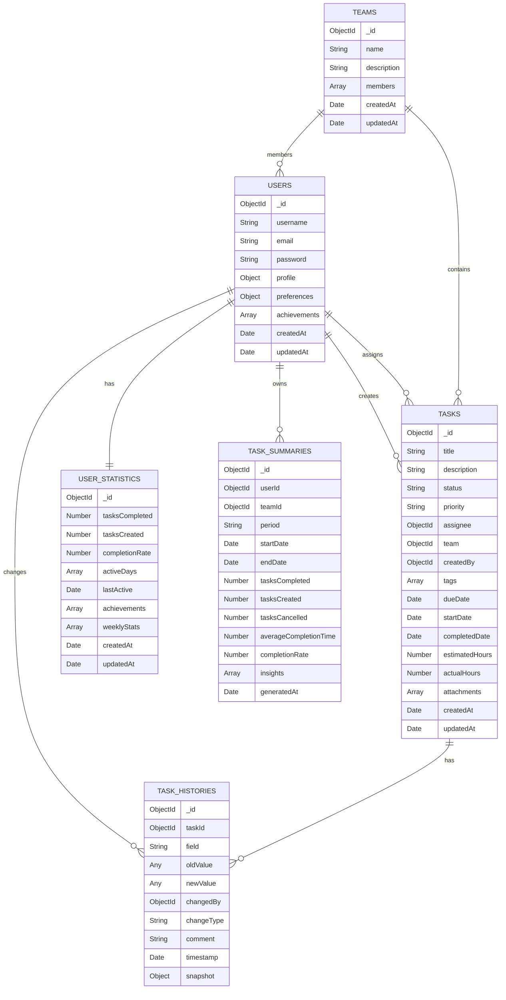

# 数据库设计

## 概述

todoIng 使用 MongoDB 作为主要数据存储，采用文档型数据库设计，支持任务生命周期管理和变更历史追踪功能。

## 数据库结构

### 数据库名称
```
todoing
```

### 集合设计

#### 1. 用户集合 (users)
存储系统用户信息。

**结构**:
```javascript
{
  _id: ObjectId,
  username: String,           // 用户名
  email: String,              // 邮箱
  password: String,           // 加密密码
  profile: {
    avatar: String,           // 头像URL
    firstName: String,        // 名字
    lastName: String,         // 姓氏
    bio: String,              // 个人简介
    skills: [String],         // 技能标签
    location: String          // 位置
  },
  preferences: {
    theme: String,            // 主题设置
    notifications: {
      email: Boolean,         // 邮件通知
      push: Boolean           // 推送通知
    },
    language: String          // 语言设置
  },
  achievements: [{
    id: String,               // 成就ID
    name: String,             // 成就名称
    description: String,      // 成就描述
    earnedAt: Date            // 获得时间
  }],
  createdAt: Date,            // 创建时间
  updatedAt: Date             // 更新时间
}
```

**索引**:
- `_id`: 主键索引
- `email`: 唯一索引
- `username`: 唯一索引
- `createdAt`: 普通索引

#### 2. 团队集合 (teams)
存储团队信息。

**结构**:
```javascript
{
  _id: ObjectId,              // 团队ID
  name: String,               // 团队名称
  description: String,        // 团队描述
  avatar: String,             // 团队头像URL
  members: [{                 // 团队成员
    user: ObjectId,           // 用户ID (引用 users._id)
    role: String,             // 角色 (owner, admin, member)
    joinedAt: Date            // 加入时间
  }],
  createdAt: Date,            // 创建时间
  updatedAt: Date             // 更新时间
}
```

**索引**:
- `_id`: 主键索引
- `name`: 普通索引
- `members.user`: 普通索引
- `createdAt`: 普通索引

#### 3. 任务集合 (tasks)
存储所有任务信息。

**结构**:
```javascript
{
  _id: ObjectId,              // 任务ID
  title: String,              // 任务标题
  description: String,        // 任务描述
  status: String,             // 任务状态 (created, in-progress, paused, completed, cancelled)
  priority: String,           // 优先级 (low, medium, high)
  assignee: ObjectId,         // 分配给 (引用 users._id)
  team: ObjectId,             // 团队 (引用 teams._id, 可选)
  createdBy: ObjectId,        // 创建者 (引用 users._id)
  tags: [String],             // 标签
  dueDate: Date,              // 截止日期
  startDate: Date,            // 开始日期
  completedDate: Date,        // 完成日期
  estimatedHours: Number,     // 预估工时
  actualHours: Number,        // 实际工时
  attachments: [{             // 附件
    name: String,             // 文件名
    url: String,              // 文件URL
    size: Number,             // 文件大小
    type: String              // 文件类型
  }],
  createdAt: Date,            // 创建时间
  updatedAt: Date             // 更新时间
}
```

**索引**:
- `_id`: 主键索引
- `status`: 普通索引
- `priority`: 普通索引
- `assignee`: 普通索引
- `team`: 普通索引
- `createdBy`: 普通索引
- `dueDate`: 普通索引
- `createdAt`: 普通索引
- `updatedAt`: 普通索引
- 组合索引: `{ status: 1, assignee: 1 }`
- 组合索引: `{ priority: 1, dueDate: 1 }`
- 组合索引: `{ team: 1, status: 1 }`

#### 4. 任务历史记录集合 (task_histories)
存储任务的所有变更历史，实现类似 Git 的变更追踪功能。

**结构**:
```javascript
{
  _id: ObjectId,              // 历史记录ID
  taskId: ObjectId,           // 关联的任务ID (引用 tasks._id)
  field: String,              // 变更的字段名
  oldValue: Any,              // 变更前的值
  newValue: Any,              // 变更后的值
  changedBy: ObjectId,        // 变更者 (引用 users._id)
  changeType: String,         // 变更类型 (status-change, update, assign, create, etc.)
  comment: String,            // 变更说明 (可选)
  timestamp: Date,            // 变更时间
  snapshot: Object            // 任务快照 (可选，用于快速恢复)
}
```

**索引**:
- `_id`: 主键索引
- `taskId`: 普通索引
- `changedBy`: 普通索引
- `changeType`: 普通索引
- `timestamp`: 普通索引
- 组合索引: `{ taskId: 1, timestamp: -1 }` (按任务和时间倒序查询)
- 组合索引: `{ changedBy: 1, timestamp: -1 }` (按用户和时间倒序查询)

#### 5. 用户统计集合 (user_statistics)
存储用户统计数据。

**结构**:
```javascript
{
  _id: ObjectId,              // 用户ID (引用 users._id)
  tasksCompleted: Number,     // 完成任务数
  tasksCreated: Number,       // 创建任务数
  completionRate: Number,     // 完成率
  activeDays: [Date],         // 活跃日期
  lastActive: Date,           // 最后活跃时间
  achievements: [{            // 成就统计
    id: String,               // 成就ID
    count: Number             // 获得次数
  }],
  weeklyStats: [{             // 周统计
    week: Date,               // 周开始日期
    tasksCompleted: Number,   // 本周完成任务数
    tasksCreated: Number      // 本周创建任务数
  }],
  createdAt: Date,            // 创建时间
  updatedAt: Date             // 更新时间
}
```

**索引**:
- `_id`: 主键索引
- `lastActive`: 普通索引
- `createdAt`: 普通索引

#### 6. 任务总结集合 (task_summaries)
存储任务总结信息。

**结构**:
```javascript
{
  _id: ObjectId,              // 总结ID
  userId: ObjectId,           // 用户ID (引用 users._id)
  teamId: ObjectId,           // 团队ID (引用 teams._id, 可选)
  period: String,             // 统计周期 (daily, weekly, monthly, custom)
  startDate: Date,            // 开始日期
  endDate: Date,              // 结束日期
  tasksCompleted: Number,     // 完成任务数
  tasksCreated: Number,       // 创建任务数
  tasksCancelled: Number,     // 取消任务数
  averageCompletionTime: Number, // 平均完成时间(小时)
  completionRate: Number,     // 完成率
  insights: [{                // 系统生成的洞察
    type: String,             // 洞察类型
    message: String,          // 洞察信息
    severity: String          // 严重程度 (low, medium, high)
  }],
  generatedAt: Date           // 生成时间
}
```

**索引**:
- `_id`: 主键索引
- `userId`: 普通索引
- `teamId`: 普通索引
- `period`: 普通索引
- `generatedAt`: 普通索引
- 组合索引: `{ userId: 1, period: 1, generatedAt: -1 }`

## 数据关系图



## 数据模型设计考虑

### 1. 任务生命周期设计
- 任务状态采用枚举类型，确保数据一致性
- 状态转换通过历史记录追踪，便于回溯和审计
- 每个状态变更都会在 [task_histories](file:///Volumes/M20/code/docs/todoIng/docs/database-design.md) 集合中创建记录

### 2. 历史记录设计
- 采用独立集合存储历史记录，避免任务文档过大
- 每次任务更新都会在历史记录中创建一条或多条记录
- 支持快照功能，可以保存任务在特定时间点的完整状态
- 提供变更类型字段，便于筛选和分析不同类型的变更

### 3. 团队设计
- 团队成员以内嵌数组形式存储，便于查询团队成员
- 支持多种角色类型，便于权限管理
- 任务可以关联到团队，支持团队协作

### 4. 用户扩展设计
- 用户信息分为基本信息、个人资料和偏好设置，结构清晰
- 支持成就系统，增强用户粘性
- 用户统计独立存储，避免频繁更新用户文档

### 5. 性能优化考虑
- 为常用查询字段创建索引，提高查询效率
- 使用组合索引优化复杂查询
- 历史记录按时间倒序索引，便于获取最新变更
- 任务和历史记录分离，避免单个文档过大
- 统计数据独立存储，避免影响主业务数据性能

### 6. 扩展性考虑
- 标签字段使用数组类型，支持灵活的标签系统
- 快照字段为可选字段，为将来的任务恢复功能预留
- 变更说明字段支持添加备注信息
- 变更类型字段便于扩展新的变更类型
- 附件字段支持任务相关文件管理

## 数据一致性保证

### 1. 事务处理
- 任务更新和历史记录创建在同一个事务中完成
- 团队成员添加和相关权限更新在事务中完成
- 确保数据一致性，避免出现任务更新了但历史记录未创建的情况

### 2. 数据验证
- 应用层对所有输入数据进行验证
- 数据库层对关键字段添加验证规则
- 状态转换需要符合预定义的状态机规则

## 数据备份和恢复

### 1. 备份策略
- 每日全量备份
- 每小时增量备份
- 历史记录永久保存

### 2. 恢复机制
- 支持基于时间点的数据恢复
- 支持基于特定历史记录的任务状态恢复
- 提供数据导出功能

## 数据清理策略

### 1. 软删除
- 任务删除采用软删除方式，保留历史记录
- 提供数据归档功能

### 2. 历史记录保留
- 任务历史记录永久保留
- 提供历史记录清理接口（仅限管理员）

### 3. 统计数据归档
- 定期归档旧的统计数据
- 保留关键统计数据用于长期分析