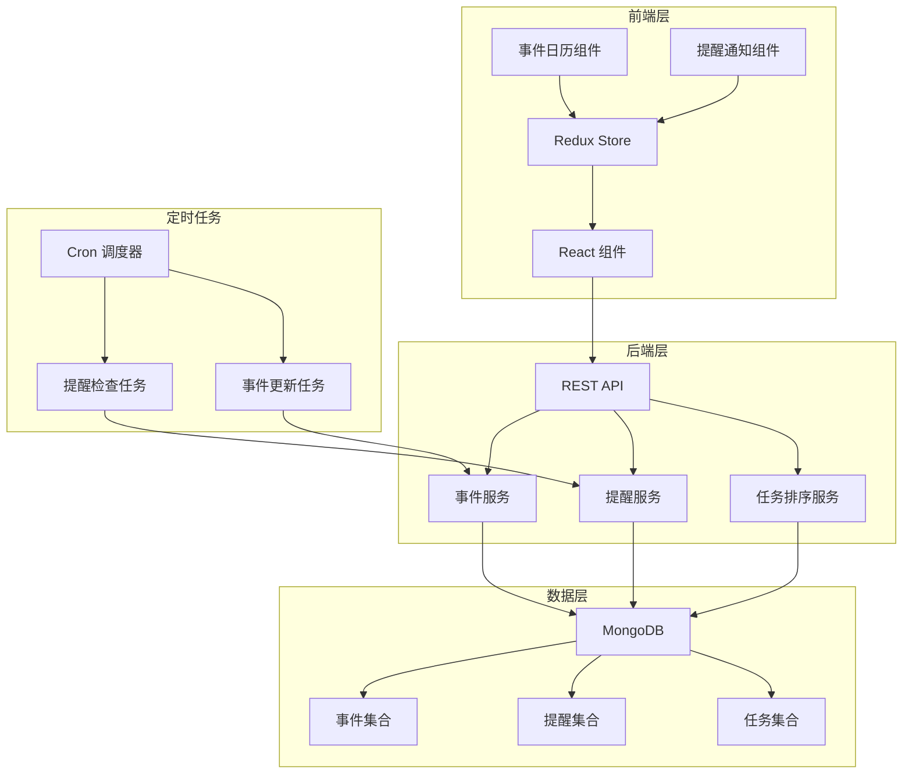
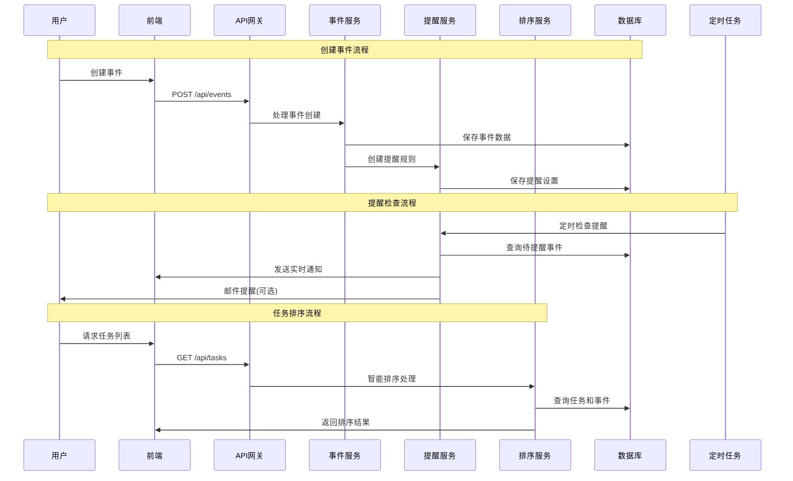
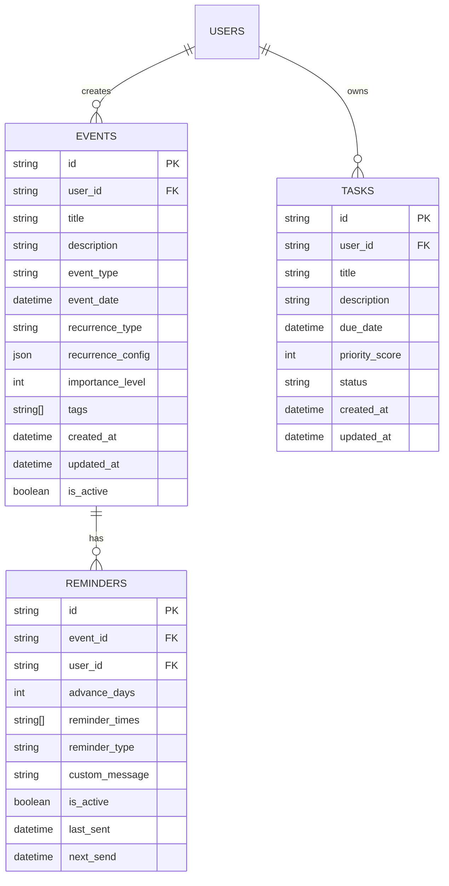
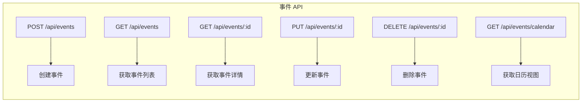
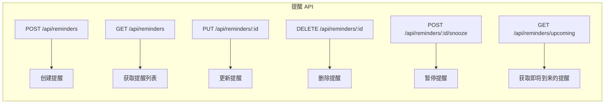
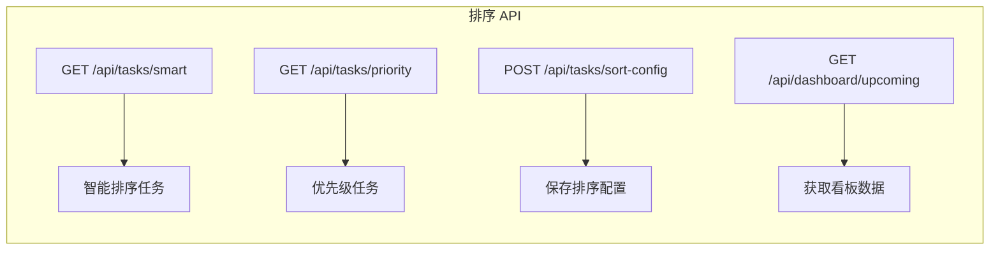
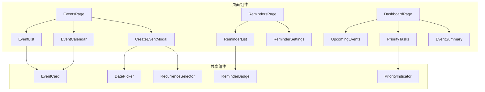
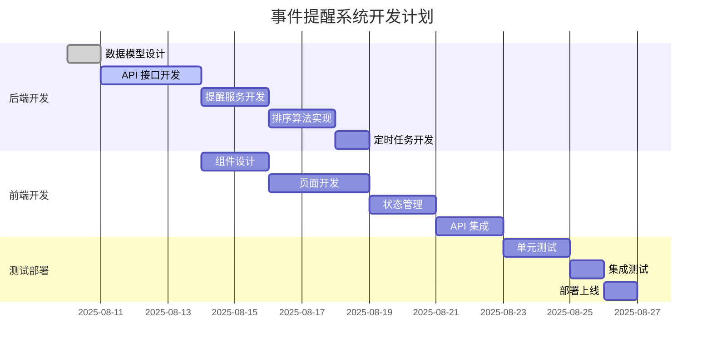

# 事件记录与提醒系统技术方案

## 1. 系统概述

事件记录与提醒系统是 TodoIng 项目的扩展功能，旨在提供：
- **事件管理**：创建和管理纪念日、重要事件等
- **智能提醒**：多种提醒方式和频率设置
- **任务优先级**：基于时间的智能任务排序
- **循环事件**：支持年度、月度等重复事件

## 2. 功能需求

### 2.1 事件管理
- [x] 创建事件（纪念日、生日、节日等）
- [x] 设置事件类型和重要程度
- [x] 支持一次性和循环事件
- [x] 事件描述和备注
- [x] 事件分类和标签

### 2.2 提醒系统
- [x] 多种提醒时间设置（提前N天、当天、多次提醒）
- [x] 提醒方式：应用内通知、邮件提醒
- [x] 自定义提醒文案
- [x] 暂停/恢复提醒功能

### 2.3 智能任务排序
- [x] 近期任务优先显示（7天内）
- [x] 基于截止时间的动态排序
- [x] 重要程度权重计算
- [x] 用户自定义显示数量

## 3. 技术架构

### 3.1 系统架构图



### 3.2 数据流程图



## 4. 数据库设计

### 4.1 事件数据模型



### 4.2 Golang 数据结构

```go
// 事件模型
type Event struct {
    ID               primitive.ObjectID `bson:"_id,omitempty" json:"id"`
    UserID           primitive.ObjectID `bson:"user_id" json:"user_id"`
    Title            string            `bson:"title" json:"title"`
    Description      string            `bson:"description" json:"description"`
    EventType        string            `bson:"event_type" json:"event_type"` // birthday, anniversary, holiday, custom
    EventDate        time.Time         `bson:"event_date" json:"event_date"`
    RecurrenceType   string            `bson:"recurrence_type" json:"recurrence_type"` // none, yearly, monthly, weekly
    RecurrenceConfig map[string]interface{} `bson:"recurrence_config" json:"recurrence_config"`
    ImportanceLevel  int               `bson:"importance_level" json:"importance_level"` // 1-5
    Tags             []string          `bson:"tags" json:"tags"`
    CreatedAt        time.Time         `bson:"created_at" json:"created_at"`
    UpdatedAt        time.Time         `bson:"updated_at" json:"updated_at"`
    IsActive         bool              `bson:"is_active" json:"is_active"`
}

// 提醒模型
type Reminder struct {
    ID            primitive.ObjectID `bson:"_id,omitempty" json:"id"`
    EventID       primitive.ObjectID `bson:"event_id" json:"event_id"`
    UserID        primitive.ObjectID `bson:"user_id" json:"user_id"`
    AdvanceDays   int               `bson:"advance_days" json:"advance_days"`
    ReminderTimes []string          `bson:"reminder_times" json:"reminder_times"` // ["09:00", "18:00"]
    ReminderType  string            `bson:"reminder_type" json:"reminder_type"` // app, email, both
    CustomMessage string            `bson:"custom_message" json:"custom_message"`
    IsActive      bool              `bson:"is_active" json:"is_active"`
    LastSent      *time.Time        `bson:"last_sent" json:"last_sent"`
    NextSend      *time.Time        `bson:"next_send" json:"next_send"`
}

// 任务排序配置
type TaskSortConfig struct {
    PriorityDays    int     `json:"priority_days"`    // 优先显示天数
    MaxDisplayCount int     `json:"max_display_count"` // 最大显示数量
    WeightUrgent    float64 `json:"weight_urgent"`    // 紧急权重
    WeightImportant float64 `json:"weight_important"` // 重要权重
}
```

## 5. API 设计

### 5.1 事件管理 API



### 5.2 提醒管理 API



### 5.3 智能排序 API



## 6. 前端组件设计

### 6.1 组件架构



### 6.2 状态管理

```mermaid
graph TB
    subgraph "Redux Store"
        A[eventsSlice] --> A1[events: Event[]]
        A --> A2[loading: boolean]
        A --> A3[selectedEvent: Event]
        
        B[remindersSlice] --> B1[reminders: Reminder[]]
        B --> B2[upcomingCount: number]
        
        C[tasksSlice] --> C1[priorityTasks: Task[]]
        C --> C2[sortConfig: TaskSortConfig]
        
        D[uiSlice] --> D1[showCreateModal: boolean]
        D --> D2[notifications: Notification[]]
    end
```

## 7. 实现计划

### 7.1 开发阶段



### 7.2 技术要点

#### 7.2.1 循环事件处理
- 年度循环：生日、纪念日
- 月度循环：月度检查、还款提醒
- 自定义循环：自定义间隔天数

#### 7.2.2 智能排序算法
```go
// 任务优先级计算
func CalculateTaskPriority(task Task, config TaskSortConfig) float64 {
    now := time.Now()
    daysUntilDue := task.DueDate.Sub(now).Hours() / 24
    
    // 紧急程度 (越接近截止时间分数越高)
    urgencyScore := math.Max(0, (config.PriorityDays - daysUntilDue) / config.PriorityDays)
    
    // 重要程度 (用户设定的重要性)
    importanceScore := float64(task.ImportanceLevel) / 5.0
    
    // 综合分数
    totalScore := urgencyScore * config.WeightUrgent + importanceScore * config.WeightImportant
    
    return totalScore
}
```

#### 7.2.3 提醒调度
- 使用 Golang 的 `time.Ticker` 进行定时检查
- 支持多时间点提醒（早上、中午、晚上）
- 避免重复提醒的去重机制

## 8. 性能考虑

### 8.1 数据库优化
- 事件表按用户ID和日期建立复合索引
- 提醒表按下次发送时间建立索引
- 任务表按截止时间和优先级建立索引

### 8.2 缓存策略
- Redis 缓存用户的排序配置
- 缓存近期事件和提醒数据
- 前端本地缓存事件列表

### 8.3 实时通知
- WebSocket 连接用于实时推送提醒
- 支持离线消息队列
- 移动端推送通知支持

## 9. 安全考虑

- 用户只能访问自己的事件和提醒
- API 请求需要 JWT 认证
- 敏感信息加密存储
- 防止暴力创建大量事件

## 10. 扩展功能

- [ ] 事件分享功能
- [ ] 团队共享事件
- [ ] 事件导入/导出
- [ ] 第三方日历集成
- [ ] 移动端 App 支持
- [ ] 语音提醒功能

---

**技术方案总结：**
这个事件记录与提醒系统将显著提升 TodoIng 的用户体验，通过智能化的任务排序和多样化的提醒方式，帮助用户更好地管理时间和重要事件。系统采用模块化设计，易于扩展和维护。
